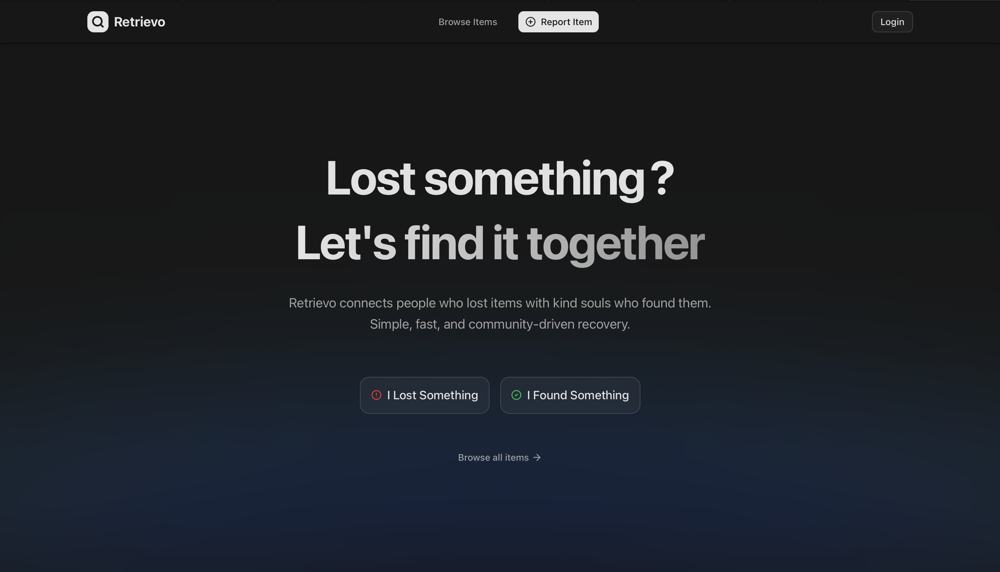

# Retrievo — Lost & Found Platform

A modern Lost & Found web application for campus communities built with Next.js 16, Tailwind CSS v4, shadcn/ui, and NextAuth v5.

<p align="center">
  
</p>

## Tech Stack

- **Framework**: [Next.js 16](https://nextjs.org/) (App Router, React 19, Server Components)
- **Styling**: [Tailwind CSS v4](https://tailwindcss.com/)
- **UI Components**: [shadcn/ui](https://ui.shadcn.com/) (New York Style)
- **Authentication**: [NextAuth v5](https://authjs.dev/) (Google OAuth + JWT backend)
- **Data Fetching**: Browser->Backend via `clientFetch()` (reads); Server Actions (mutations)
- **Client State**: [SWR](https://swr.vercel.app/) for notifications
- **Forms**: React Hook Form + Zod v4
- **Icons**: Lucide React
- **Theming**: next-themes (light/dark/class)
- **Image Processing**: heic2any (HEIC→JPEG) + canvas-based WebP compression
- **Deployment**: Docker (standalone output), Vercel-ready
- **Analytics**: @vercel/analytics + @vercel/speed-insights

## Routes

| Route | Description |
|---|---|
| `/` | Landing page with hero, CTAs, features, FAQ |
| `/items` | Browse items feed (public/boys/girls segments) |
| `/items/[id]` | Item detail — view, edit, claim/return, report, share |
| `/report?type=lost\|found` | Report a lost or found item |
| `/profile` | Authenticated user's own profile |
| `/profile/[id]` | Public user profile with their items |
| `/resolution/[id]` | Resolution/claim detail with action flow |
| `/onboarding` | First-time onboarding (hostel + contacts) |
| `/auth/signin` | Google OAuth sign-in page |
| `/auth/error` | Auth error page (access denied, banned, etc.) |
| `/admin` | Admin dashboard (users, items, reports, resolutions) |

## Architecture

### Authentication Flow

1. User clicks **Login** → Google OAuth consent screen
2. Google redirects to NextAuth callback → `signIn` callback POSTs `id_token` to backend `/auth/google`
3. Backend returns `{ access_token, expires_at }` → stored in JWT session
4. `jwt` callback fetches `/auth/me` for user profile
5. `session` callback attaches `backendToken` + user data to the client session
6. **Production**: only `@nitc.ac.in` emails allowed; all domains allowed in development
7. **Token refresh**: 1-hour expiry, no auto-refresh — expired tokens require re-auth

### Data Flow

**Reads (auth-gated data):**
```
Browser → clientFetch() → NEXT_PUBLIC_BACKEND_URL (direct, no Vercel proxy)
```
- Uses Bearer token from `useSession().backendToken`
- Used in: ItemsGrid, ItemDetail, Profile, Resolution, Admin tabs, Notifications

**Mutations (writes):**
```
Browser → Server Action → authFetch() → INTERNAL_BACKEND_URL
```
- Server Actions in `lib/api/`: items, resolutions, admin, notifications, profile
- Include `X-Internal-Secret` header for backend authentication

**Public reads (no auth):**
```
Browser → clientFetch() (no token) → NEXT_PUBLIC_BACKEND_URL
```
- Landing page items, public feed segments

### Feed Segments

Items have a `visibility` field: `"public"`, `"boys"`, or `"girls"`. The feed segment shown is derived from the user's hostel selection during onboarding. Backend-enforced via token.

### Onboarding

New users must complete onboarding before accessing protected routes:
1. Select hostel (`"boys"` or `"girls"` — immutable after first set)
2. Provide at least one contact method (phone or Instagram)

## Getting Started

### Prerequisites

- Node.js 18+ (required by Next.js 16)
- npm
- A running instance of the [Retrievo backend](https://github.com/ItsThareesh/retrievo-backend)

### Installation

```bash
git clone https://github.com/ItsThareesh/retrievo-frontend.git
cd retrievo-frontend
npm install
```

### Environment Variables

Copy `.env.example` to `.env.local`:

```bash
cp .env.example .env.local
```

| Variable | Required | Description |
|---|---|---|
| `APP_ENV` | Yes | `development` or `production` — controls email domain restriction |
| `GOOGLE_CLIENT_ID` | Yes | Google OAuth client ID |
| `GOOGLE_CLIENT_SECRET` | Yes | Google OAuth client secret |
| `NEXTAUTH_SECRET` | Yes | NextAuth session encryption key |
| `AUTH_TRUST_HOST` | Yes | Required by Auth.js — set to `true` |
| `NEXT_PUBLIC_BACKEND_URL` | Yes | Backend URL used by the browser (e.g. `http://localhost:8000/api/v1`) |
| `INTERNAL_BACKEND_URL` | Yes | Backend URL used server-side (e.g. `http://localhost:8000/api/v1`) |
| `INTERNAL_SECRET_KEY` | Yes | Shared secret for server→backend auth |

### Development

```bash
npm run dev
```

Open [http://localhost:3000](http://localhost:3000).

### Docker

**Production build:**
```bash
docker build -t retrievo-frontend .
docker run -p 3000:3000 retrievo-frontend
```

**Development:**
```bash
docker compose up
```

The `Dockerfile` uses a multi-stage build with `next output: "standalone"` for a minimal production image. `Dockerfile.dev` mounts source code as a volume for hot reloading.

## Project Structure

```
app/                     # Next.js App Router pages
├── admin/               # Admin dashboard
├── auth/                # Sign-in & error pages
├── items/               # Item feed & detail
├── onboarding/          # First-time onboarding
├── profile/             # User profiles
├── report/              # Report lost/found item
├── resolution/          # Resolution/claim flow
├── layout.tsx           # Root layout (SessionProvider, ThemeProvider, etc.)
├── page.tsx             # Landing page
└── not-found.tsx        # Custom 404

components/              # React components
├── ui/                  # shadcn/ui primitives
├── navbar.tsx           # Server navbar
├── navbar-auth.tsx      # Client auth section (login button, notifications, user menu)
├── item-card.tsx        # Item card for grids
├── items-grid-client.tsx# Infinite scroll feed
├── user-menu.tsx        # Avatar dropdown with sign-out
└── ...

lib/                     # Core logic
├── auth.ts              # NextAuth configuration
├── client-fetch.ts      # Browser→backend fetch utility
├── api/                 # Server Actions (mutations only)
│   ├── helpers.ts       # authFetch, publicFetch, internalFetchWithTimeout
│   ├── items.ts         # postLostFoundItem, updateItem, deleteItem, flagItem
│   ├── resolutions.ts   # create/approve/reject/complete/fail resolution
│   ├── admin.ts         # moderateUser, moderateItem
│   ├── notifications.ts # readNotification, readAllNotifications
│   └── profile.ts       # updateOnboarding
├── constants/           # Locations, report reasons
├── hooks/               # useNotifications, useItemEditable, useDebounce
└── utils/               # cn(), image compression, validation, date formatting

types/                   # TypeScript type definitions
├── user.ts
├── item.ts
├── resolutions.ts
├── notification.ts
├── admin.ts
└── next-auth.d.ts       # Session type augmentation

public/                  # Static assets
```

## Key Conventions

- **Server-First**: Prefer Server Components; use `"use client"` only when interactivity is needed
- **Image Compression**: Uploaded images are compressed to WebP ≤ 0.9 MB (HEIC/HEIF supported)
- **Diff-Only PATCHES**: Item edits send only changed fields to the backend
- **Debounced Search**: 400ms debounce on search input to reduce server load
- **Error Handling**: `UnauthorizedError` from `authFetch` triggers redirect to sign-in
- **Auth Guards**: In `page.tsx` files (redirect to `/auth/signin` or `/onboarding`), never in middleware
- **Token in Session**: `backendToken` attached to session — never stored in `localStorage`

## Scripts

| Command | Description |
|---|---|
| `npm run dev` | Start development server |
| `npm run build` | Production build |
| `npm run start` | Start production server |
| `npm run lint` | Run ESLint |

## Backend Integration

This frontend communicates with a [FastAPI backend](https://github.com/ItsThareesh/retrievo-backend):

- **Browser→Backend**: `clientFetch()` in `lib/client-fetch.ts` — direct API calls with Bearer token
- **Server→Backend**: `authFetch()` / `publicFetch()` in `lib/api/helpers.ts` — includes `X-Internal-Secret` header
- **Endpoints**: Items CRUD, resolutions, admin moderation, notifications, profile, auth
- **Image CDN**: `cdn.retrievo.dev` for uploaded item images
